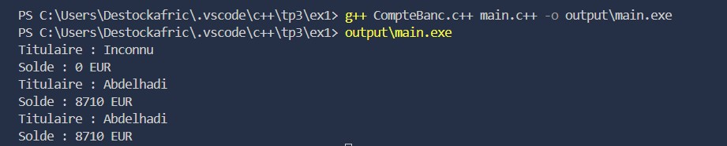
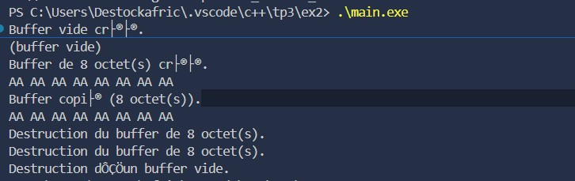

# TP C++ – Gestion de Constructeurs et Mémoire Dynamique

## Exercice 1 : Gestion d’un Compte Bancaire

### Description
Ce projet simule la gestion d’un compte bancaire en C++.  
La classe `CompteBancaire` permet de manipuler un **titulaire** et un **solde**, tout en illustrant l’utilisation des **différents constructeurs** (par défaut, paramétré, de copie) ainsi qu’un **destructeur**.

### Fonctionnalités

1. **Gestion du compte bancaire**
   - Créer un compte vide avec le **constructeur par défaut**
   - Créer un compte avec un **titulaire et un solde initial** (constructeur paramétré)
   - Copier un compte existant avec le **constructeur de copie**
   - Afficher les informations du compte avec `afficher()`
   - Observer la destruction automatique des objets via le **destructeur**

### Résultats du programme
Le programme affiche les informations des comptes créés et détruits pendant l’exécution.  

---

## Exercice 2 : Gestion d’un Buffer Dynamique

### Description
Ce projet met en œuvre la gestion **manuelle de la mémoire** en C++.  
La classe `Buffer` encapsule un **tableau dynamique d’octets** et démontre la **règle des trois** (constructeur de copie, opérateur d’affectation, destructeur).

### Fonctionnalités

1. **Gestion du buffer**
   - Créer un buffer vide avec le **constructeur par défaut**
   - Créer un buffer de taille donnée avec le **constructeur paramétré**
   - Copier un buffer existant avec le **constructeur de copie**
   - Remplir le buffer avec `fill()`
   - Afficher le contenu en hexadécimal avec `printHex()`
   - Libérer la mémoire avec le **destructeur**

### Résultats du programme
Le programme affiche les tailles, les contenus des buffers et les messages de création/destruction des objets.  

